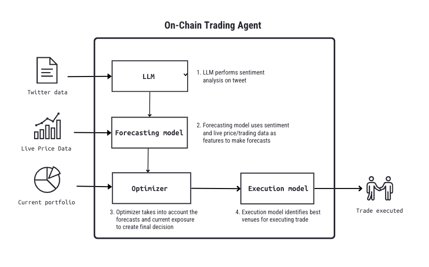
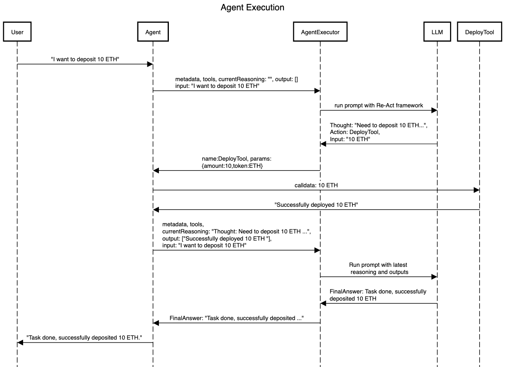

# ERC Proposal: Interoperable On-chain Agents Standard

## Simple Summary

A standardized interface and execution framework for composable on-chain agents (backed by large language models) and tools that can be nested and combined to create powerful autonomous entities on on-chain. 

## Abstract

This ERC proposes the introduction of a framework for on-chain interoperable agents, a novel development in the field of decentralized artificial intelligence. Building on the capabilities of Large Language Models (LLMs) and smart contracts, on-chain agents merge advanced language understanding and intelligence with blockchain technology, offering increased verifiability, transparency, and accessibility to a wide range of AI applications. These agents, encapsulated within smart contracts on EVM-based blockchains, can autonomously execute complex tasks, from managing DAO operations to making high-stakes financial decisions. When we let agents interact with each other in a standardized and composable way, we can create a network of autonomous actors that can utilize each other based on needs and specializations, creating a thriving ecosystem of on-chain intelligence. We also propose an execution framework for agents that supports both on-chain and off-chain execution. 

In addition, we also introduce the concept of on-chain tools. Tools allow agents to execute specific tasks and interact with their environment - agents can reason about what tools they need to use and in what way, in order to achieve their overall goal. These tools are designed such that they are easy to reuse between different agents. Tools can either be backed by simple smart contracts, which allows the agent to interact with smart contracts - the same way a regular end-user would, or other ML or AI models. The use of AI models as tools allows agent to outsource complex tasks to optimized models. We believe that rather than having a single all-knowing models that agents will rely on for every task, they can utilizer multiple smaller models, each optimized for a specific goal. This architecture results in better utility and effectiveness.

Last but not least, we also lay out an abstract implementation of an on-chain agent that runs in a verifiable on-chain execution environment, and is customizable for any task. We also created a autonomous trading agent for demonstrating how straightforward it is to create your own agent using this framework.

## Motivation

### Why we need on-chain agents

On-chain agents leverage Large Language Models (LLMs) within the EVM ecosystem to create a powerful combination of language understanding, reasoning, and decentralized execution. The primary motivation behind this proposal is to address the critical need for trust and transparency in high-impact scenarios where agents might be utilized, such as executing trades, managing DAOs or making financial decisions. Blockchain’s intrinsic properties give agents the attributes we need to be able to trust them with these critical decisions. Specifically, blockchain gives agents traceability, verifiability, immutability, censorship-resistance, global accessibility, and a collaborative development environment. Up until now, almost all LLMs and agents were hosted on centralized infrastructure - we hope that with the introduction of this standard, as well as ongoing technological developments, we can build a pathway for bringing them directly onto the blockchain.

At a high-level, similar to off-chain agents, we expect on-chain agents to be able to make decisions on their own, and perform tasks in their environment without any human involvement - though we might expose options for them to get human feedback. Agents should also be able to adapt to new situations and scenarios that they haven’t been explicitly programmed for, enhancing their flexibility and effectiveness. Finally, we also expect agents to break down goals into small tasks and to utilize tools to achieve them according to their reasoning, which is achieved through function calling models or reasoning techniques such as ReAct Prompting.

### Composability

We aim to create a framework where agents can be built in a standardized and interoperable way, so they can leverage each other, and other tools to achieve complex tasks and outcomes together. This stands in stark contrast to designs where a single model or agent is supposed to handle everything on its own. We believe such agents are less effective, because the surface area the agent has to work with will explode, which leads to subpar results and efficiency. We saw this pattern emerge in traditional software engineering as well, where each class has its own, well-defined responsibility, and relies on other classes to outsource certain tasks. Similarly, as humans we tend to specialize and rely on each other instead of trying to learn and do everything ourselves.

We expect agents to build on top of each other, through the use of tools and reasoning frameworks, such as Re-Act or Chain-of-Thought (CoT) prompting, where agents decide what tools they should use to achieve their overall goal. Tools can be used by agents to interact with their surrounding environment, such as transferring tokens or making transactions, and to inspect their environment as well, such as viewing token balances. Tools can either be implemented by other agents, or by regular smart contracts through implementing the proposed standardized interface, and making it accessible to everyone. We believe agents are only as good as the tools they have, so it’s important to design with composability in mind such that these tools can be used and reused effectively.

To demonstrate how all of this fits together, we show an example workflow below where an autonomous trading bot uses Tweets and live price data to find the best trades and execute them. 



The agent first uses an LLM to analyse the tweet. This LLM could be a smaller and cheaper model, suitable for sentiment analysis. Next, it feeds the sentiment score and live pricing data to a forecasting model to predict price movement. The output of the forecasting model is then passed to an Optimizer tool that takes into account the forecasts and current exposure to make a final decision. If the optimizer indicates that a trade should be carried out, the agent forwards it to an execution model that identifies the best way to execute the trade and performs it.

In this example, the agent utilizes specialzied models and tools for certain sub-tasks so it doesn't have to implement everything on its own. The models can be classical ML models or complex LLMs. In addition, it can also build on top of other agents more more complex tasks, such as running the Optimizer. This example highlights, how powerful having an open and composable architecture for agents and models can be, unlocking the pathway to a future where rather than building all-knowing agents and models, we can offload work to specialized models that are reusable and more effective at what they do.

### Execution Environment

The current blockchain environment is infeasible for directly executing models agents on-chain, primarily due to the enormous cost and computational capacity required to run large or even small models. Currently, the most promising alternative is off-chain inference that is verified on-chain through cryptographic or cryptoeconomic security schemes, such as ZKML (Zero-Knowledge Machine-Learning) or OP-ML (Optimistic Machine-Learning). This proposal also anticipates that further technological advancements will diminish drawbacks over time, envisioning a future where blockchain becomes an icnreasingly viable ecosystem for agents and AI.

We propose 2 types of execution frameworks in order to provide as much flexibility as possible for current and future agent implementations:

- *Callback execution*
- *Embedded execution*

First is Callback execution, where only the prompts, tools and overall structure of the agent and tools are stored on-chain, but the actual execution are handled by traditional off-chain networks, such as oracles. When the agent requires executing an AI model, such as LLM, a request is initiated to the off-chain environment which returns the output of the model to the agent through a callback function. A proof might also be returned in order to verify the model execution. The agent can then continue its execution using the output of the model. This setup makes it more straightforward to implement agents right now, however, due to the callback transactions required, it makes it harder to implement and reason about the current state of agents and ensure atomicity.

The second option is Embedded execution, where inference is still handled by off-chain networks, however the blockchain itself would manage, handle and verify the off-chain execution as part of the EVM, providing a more developer-friendly platform for building and running agents. This functionality could be exposed through a precompile or other similar mechanisms, where the underlying VM is responsible for interacting with the external model execution component and the agent smart contract can synchronously receive the model output. This would provide a convenient environment for running agents atomically, within a single transaction, not having to break it down into multiple distinct functions and callback transactions. This approach could also provide both a superior developer and user experience. The primary downside of this approach is the complexity that it would take to build support for off-chain model inference directly into the blockchain and making sure that transactions remain performant.

In this proposal, we'll dive deeper into how Embedded execution might look like, however, all of the interfaces proposed are designed with Callback and Embedded execution in mind.

## Specification

We are going to define the specifications going from the bottom up, first showing the tool spec, then an on-chain agent spec and implementation, and its client interface. Because we want agents to be reused as tools by higher-level agents, agents themselves will also implement the tool spec. Finally, we also specify an agent executor smart contract interface that could be implemented as a precompile for optimal efficiency.

### Tool definition

A `IERCAgentTool` defines a tool the agent can use to either inspect or take an action in its environment. The agent will use metadata such as tool name and description to decide when it's appropriate to use it. In most cases, the tool can either be implemented by a traditional smart contract, or by another on-chain agent. Since all agents are wrapped in their own smart contract (see `IERCAgent`), it is very straightforward to also reuse them as tools in other agents, which is also one of the explicit goals of this ERC. 

```solidity
interface IERCAgentTool {

    /// @notice describes the various types of input parameters a tool can have.
    ///   Right now, only primitive types are supported.
    enum ParamType {
        STRING,
        ADDRESS,
        BOOL,
        INT,
        UINT,
        STRING_ARRAY,
        ADDRESS_ARRAY,
        BOOL_ARAY,
        INT_ARRAY,
        UINT_ARRAY
    }

    /// @notice Describes all parameters a tool expects as input.
    struct InputDescription {        
        ParamDescription[] paramDescriptions;
    }
    
    /// @notice Describes a single parameter of the tool input.
    struct ParamDescription {
        /// @notice type of the argument
        ParamType paramType;
        /// @notice name of the argument, to be used by the agent
        string name;
        /// @notice description of the argument, to be used by the agent
        string description;
    }
    
    /// @notice Describes a parameter that should be used for invoking the tool.
    struct ParamValue {
        ParamType paramType;
        bytes value;
    }
    
    /// @notice Describes all parameters that should be used for invoking the tool.
    struct Input {
        /// @notice the parameters for the tool in order, based on the InputDescription.
        /// @dev You can use these raw values when you want to do custom checks on the input,
        ///   or overrides before passing them to the tool.
        ParamValue[] params;

        /// @notice the parameter values in abi-encoded format, based on the InputDescription.
        bytes abiEncodedParams;
    }
    
    /// @notice Returns the name of this tool, should be short and meaningful. 
    /// @return Name of the tool.
    function name() external view returns (string memory);
    
    /// @notice Returns the description of this tool, when it should be used
    ///   and what it does at a high level.
    /// @return Description of the tool.
    function description() external view returns (string memory);
    
    /// @notice Returns the specification of the input the tool expects.
    /// @return InputDescription of the input to this tool.
    function inputDescription() external view returns (InputDescription memory);
    
    /// @notice Runs the tool with the given input and returns the result.
    /// @dev Tools might be implemented as synchronous or asynchronous. When executed
    ///    asynchronously, the method returns a runId immediately, which will be passed
    ///    to the resultHandler callback upon completion. Asynchronous tools should primarily
    ///    be used for wrapping agents that are run off-chain.
    /// @param input The input to this tool that matches the inputDescription spec.
    /// @param resultHandler The contract that will receive the result of this tool execution,
    ///   when executed asynchronously. Must support the IERCAgentToolClient interface.
    /// @return runId when the tool's execution is synchronous, the runId will be -1.
    ///   When it is asynchronous, a non-negative runId will be returned that will be
    ///   passed to the result handler once the result is ready.
    /// @return result only present when the tool was executed synchronously and runId is -1.
    ///   Do not use unless the runId returned was -1. 
    function run(Input memory input, address resultHandler) external returns (int256 runId, string memory result);
}
```

- `InputDescription`: Describes all parameters that the tool expects. The agent might use this metadata to generate the input values for tool use.
- `ParamDescription`: Describes a single parameter that the tool expects. The agent might use this metadata to generate a value for the specific parameter for tool use.
- `name`: Gives a meaningful and reasonably unique name to the tool. Agents could use this to decide when it’s appropriate to use this tool. Examples could be TokenTransferTool, ViewBalanceTool.
- `description`: Gives a short description of what the tool does, and when it should be used. Agents could use this description to decide if it’s appropriate to utilize this tool. An example might be: "Transfers tokens from one user to another".
- `inputDescription`: Describes the format of the input (if any) the tool expects to receive. Agents will use this to generate an input based on the specific task they want to achieve. 
- `run`: Triggers the execution of a tool with a given input. Tools can either be executed synchronously or asynchronously. When executed synchronously, the result will be immediately returned to the called. However, when it is executed asynchronously, result will be passed to the resultHandler, which must implement the IERCAgentClient interface. When executed asynchronously, the run method will commit and return a runId that will be used to invoke the resultHandler once the agent execution has completed. This allows tools and agents to be executed off-chain, and to post the result through this callback mechanism once it’s ready. In addition, the run method may also be used to add custom checks or verification logic to the tool. It is not possible to determine based on the interface alone whether a tool will run synchronously or asynchronously.

### On-chain Agent abstract class

Next, we define an on-chain (synchronous) agent abstract class. This contract can easily be subclassed to implement a custom agent for any task without having to deal with low-level implementation details. The agent it self runs synchronously using an `agentExecutor` contract, meaning that clients don't have to rely on callbacks to receive its result.

An agent is backed by an LLM, and uses a set of tools to operate in its environment. Since agents themselves can also be used as tools in other agents, we make them implement the `IERCAgentTool` interface.

```solidity
/// @notice Implements a synchronous agent that's backed by an on-chain agentExecutor 
abstract contract IERCAgent is IERCAgentTool {

    /// @notice Logged when the agent completes a run.
    /// @param runId the ID of the run
    /// @param executionSteps contains any additional set of details about
    ///   what actions the agent took and how it completed the task, in order. 
    ///   May be empty. 
    /// @param requester the address that requested this execution
    /// @param answer the answer returned by the agent
    event AgentRunResult(
        int256 indexed runId,
        address requester, 
        string[] executionSteps,
        string answer);

    address agentExecutorContract;
    string modelId;
    string agentName;
    string agentDescription;
    string basePrompt;
    IERCAgentTool.InputDescription agentInputDescription;
    IERCAgentTool[] tools;
    uint16 agentMaxIterations; 
    int256 currentRunId;
    
    /// @notice Creates a new agent
    /// @param _agentExecutorContract points to a contract that implements IERCAgentExecutor
    /// @param _modelId an identifier for the model that should be used for agent execution
    ///   can be an ID, name, or hash, depending on what the IERCAgentExecutor implementation details
    /// @param _name the name of the agent
    /// @param _description the description of the agent
    /// @param _basePrompt the base prompt for the agent that describes its task to the LLM
    /// @param _tools the tools the agent should have access to
    /// @param _agentMaxIterations the maximum number of iterations an agent should take
    ///   when running a particular task. One iteration includes one use of a tool. Use
    ///   this to put an upper limit on the agent execution in case it gets stuck.
    constructor(
        address _agentExecutorContract,
        string memory _modelId,
        string memory _name,
        string memory _description,
        string memory _inputDescription,
        string memory _basePrompt,
        IERCAgentTool[] memory _tools,
        uint16 _agentMaxIterations
    ) {
        agentExecutorContract = _agentExecutorContract;
        modelId = _modelId;
        agentName = _name;
        agentDescription = _description;
        basePrompt = _basePrompt;
        
        // Create "prompt" input param 
        IERCAgentTool.ParamDescription memory promptParam = 
            IERCAgentTool.ParamDescription(IERCAgentTool.ParamType.STRING, "prompt", _inputDescription);
        IERCAgentTool.ParamDescription[] memory params = 
            new IERCAgentTool.ParamDescription[](1);
        params[0] = promptParam;
        agentInputDescription = IERCAgentTool.InputDescription(params);
        
        tools = _tools;
        agentMaxIterations = _agentMaxIterations;
        currentRunId = 0;
    }
    
    /// @notice Returns the name of this agent.
    /// @return The name of the agent.
    function name() external view returns (string memory) {
        return agentName;
    }
    
    /// @notice Returns the description of this agent, when it should be used
    ///   and what it does at a high level.
    /// @return The description of the agent.
    function description() external view returns (string memory) {
        return agentDescription;
    }
    
    /// @notice Returns the type and rough format of the input the agent expects.
    /// @return InputDescription of the input this agent.
    function inputDescription() external view returns (IERCAgentTool.InputDescription memory) {
        return agentInputDescription;
    }
    
    /// @notice Runs the agent with the given input synchronously.
    /// @param input The input to this agent that is generated using the inputDescription.
    /// @param resultHandler unused, only synchronous executon is supported.
    /// @return runId will be -1, only synchronous execution is supported.
    /// @return result of the agent invocation
    function run(IERCAgentTool.Input memory input, address resultHandler) external virtual returns (int256, string memory) {
        require(input.params.length == 1, "Agent always expects a single parameter");

        IERCAgentExecutor agentExecutor = IERCAgentExecutor(agentExecutorContract);

        string[] memory agentReasoning = new string[](agentMaxIterations);
        string[] memory toolResults = new string[](agentMaxIterations);

        (string memory prompt) = abi.decode(input.params[0].value, (string));

        currentRunId++;
        
        uint16 currentIteration = 0;
        for (; currentIteration < agentMaxIterations; currentIteration++) {
            AgentIterationResult memory iterationResult = agentExecutor.runNextIteration(
                modelId,
                basePrompt,
                tools,
                agentReasoning,
                toolResults,
                prompt
            );
            
            if (iterationResult.isFinalAnswer) {
                // agent is done, emit event and return answer
                string[] memory executionSteps = new string[](currentIteration);
                for (uint i = 0; i < currentIteration; i++) {
                    executionSteps[i] = agentReasoning[i];
                }
                
                emit AgentRunResult(
                    currentRunId,
                    msg.sender,
                    executionSteps,
                    iterationResult.finalAnswer
                );
                
                return (-1, iterationResult.finalAnswer);
            } else {
                IERCAgentTool tool = iterationResult.tool;
                (bool success, bytes memory returnValue) = address(tool).call(abi.encodeWithSelector(
                    IERCAgentTool.run.selector, iterationResult.toolInput.abiEncodedParams));
                require(success, "Tool call failed");

                (int256 runId, string memory result) = abi.decode(
                    returnValue, (int256, string));
                require(runId == -1, "Only synchronous tools supported");
                
                agentReasoning[currentIteration] = iterationResult.agentReasoning;
                toolResults[currentIteration] = result;
            }
        }
        
        revert("Agent failed to produce final answer within agentMaxIterations");
    }
}
```

- `agentExecutorContract`: A contract that can execute a single iteration of an agent. Must implement the `IERCAgentExecutor` interface. In many cases, this can be a precompile to optimize for speed of execution, cost and flexibility. 
- `name`, `description`, `inputDescription`: see `IERCAgentTool`.
- `tools`: The set of tools the agent can operate with. Can either be a regular smart contract function, or another agent that’s encapsulated in a smart contract. 
- `agentMaxIterations`: the maximum number of times the agent can use a tool as part of a single execution (i.e. calling run). This makes sure the agent eventually terminates in case it ever gets lost and doesn’t have a path forward for solving its task.
- `AgentRunResult`: an event that helps inspect what the agent actually did in more detail, how it arrived at its final answer, and what (if any) actions it took as part of it. For example, if the agent transferred some token on behalf of you to another user, the executionSteps should have an explicit step about this action, such as `Transfer{from: A, to: B, token: X, amount: Y}`
- `run`: we implement a synchronous agent execution method that relies on the `agentExecutorContract` to build and run the LLM prompts using the help of a reasoning engine such as Re-Act. The precompile builds the prompt using the agent name, description, tools and user input, and adds reasoning-specific parts as well to the prompt. It then executes the prompt, parses the response and returns it to the agent contract. The response might either be a finalAnswer, meaning that the agent is done with its task, or a tool invocation, which means that the agent wants to execute a tool in order to achieve its overall goal. In addition to the tool and its input, we also return the agent’s reasoning so far, so for the next iteration it can pick up where it left off and figure out what it needs to do next. We do this until the agent arrives at a final answer, or until we exceed the `agentMaxIterations`, in which case we throw an error.

### Agent executor interface

Next, we define an interface for running a single iteration of an `IERCAgent`. Note that a single call to `run` on an agent might result in one or more iterations, as the agent might decide to use multiple tools to achieve its task. 

A call to this executor will return what the agent thinks should do next, whether it's using another tool, or returning a final answer. We provide a precompile implementation of this interface later.

```solidity
/// @notice represents the result of a single iteration of the agent reasoning loop
struct AgentIterationResult {

    /// @notice true if the agent has completed its task and arrived at a final answer
    bool isFinalAnswer;
   
    /// @notice the agents final answer to its given task, only present when 
    ///   isFinalAnswer is true.
    string finalAnswer; 
   
    /// @notice the tool the agent wants to use, only present when isFinalAnswer is false
    IERCAgentTool tool;
    /// @notice the input for the selected tool, only present when isFinalAnswer is false
    IERCAgentTool.Input toolInput;
    /// @notice the agent's reasoning for why it selected the tool and its input,
    ///   only present when isFinalAnswer is false
    string agentReasoning;
}

/// can be implemented as a precompile
interface IERCAgentExecutor {

    /// @notice Executes a single iteration of the agent's reasoning loop
    /// @param modelId the LLM model to be used for running the agent
    /// @param basePrompt the high-level description of what the agent should be aiming
    ///   for when given a task. Will be passed to the LLM.
    /// @param tools list of tools the agent can use
    /// @param agentReasoning list of all reasoning pieces returned in `AgentIterationResult` 
    ///   by earlier calls to this method within the same run.
    /// @param toolResults stringified results of every tool invocation requested by 
    ///   the agent. Must match up with the order of invocations.
    /// @param prompt the input for this specific agent invocation, eg a query 
    ///   submitted by the user
    function runNextIteration(
        string memory modelId,
        string memory basePrompt,
        IERCAgentTool[] memory tools,
        string[] memory agentReasoning,
        string[] memory toolResults,
        string memory prompt) external returns (AgentIterationResult memory);
}
```

- `AgentIterationResult`: represents the outcome of one iteration of the agent. Can either be a finalAnswer  which indicates the agent has completed its task, or a tool invocation, which means that the agent wants to use the given tool with the given input. finalAnswer is only present when isFinalAnswer is set to true , and the tool invocation fields are only set when isFinalAnswer is false 
- `runNextIteration`: executes a single iteration in the agent’s reasoning loop. All the parameters including `modelId`, `basePrompt`, `tools` must be supplied from the agent contract. agentReasoning should be initially empty, however, after each iteration, clients should append the latest agentReasoning string from the `AgentIterationResult` returned by the last `runNextIteration` invocation. In addition, the output of every tool invocation must be appended to the `toolResults` parameter. `runNextIteration` may be called until `isFinalAnswer` is set to `true` in the return value, at which point the agent has finished its task.

To see how this method might be used to run an agent with a given task end-to-end, we provide a pseudocode below for a hypothetical client. Also see `IERCAgent.run` for full implementation.

```python
def runAgent(agent, agentExecutor, userInput):
    agentReasoning = []
    while True:
        iterationResult = agentExecutor.runNextIteration(
            agent.modelId,
            agent.basePrompt,
            agent.tools,
            agentReasoning,
            toolResults,
            userInput)

        if iterationResult.isFinalAnswer:
            return iterationResult.finalAnswer
        
        toolOutput = iterationResult.tool.call(iterationResult.toolInput)

        agentReasoning.append(iterationResult.agentReasoning)
        toolResults.append(toolOutput)
```

### Asynchronous Agent client interface

Finally, for asynchronous execution, we define a callback interface that receives the final result of an agent executed off-chain.

```solidity
/// @notice Used to receive the result of asynchronous agent executions
interface IERCAgentClient {
   
    /// @notice Used to pass the result of the agent invocation back to the caller.
    /// @dev implementations must verify that the sender of this message is the agent
    ///   that they originally issued the request for
    /// @param runId the runId that was returned by the run call of agent
    /// @param result the final answer and result of the requested task from the agent
    function handleAgentResult(int256 runId, string memory result) external;
}
```

- `handleAgentResult`: called by the agent when the result of the execution with the given `runId` is available. Clients could expect this callback to be called either as part of the original run call, when the agent runs synchronously, or as a separate transaction if the agent is executed asynchronously. 

## Rationale

The standard is intended to establish an interface and execution framework for agents that can freely interact and build on each other. Similar to how classes expose interfaces for other classes to use in object-oriented programming, agents should be able to communicate and share their capabilities and the type of input they expect from consumers. The primary difference is that for agents, everything is expressed as a natural language string. Agents that want to utilize existing agents deployed to the network can use reasoning frameworks such as chain-of-thought or Re-Act to use “tools” to solve their tasks. These tools could be smart contracts or other agents. When used from a reasoning framework, the name, description and input description serves as direct guidance for the parent agents to decide when it’s appropriate to use a tool. Clients who are using these agents directly, and not through other agents do not have to utilize the additional metadata (name, description, input description), but they can still use them as a source of documentation for what the agent is intended for and how it should be used. These clients still benefit from the flexible execution environment laid out in this ERC.

In order to allow both fully on-chain, and off-chain agent execution environments, we introduced the `IERCAgentClient` which allows for asynchronous execution with a callback. We want to provide as much flexibility for both current and future agent implementations as possible. Both on-chain and off-chain AI and ML inference solutions are being built in the community, so it is important to remain open to a wide range of solutions. In our reference, we provide a synchronous, on-chain agent executor precompile that could be used to run agents seamlessly in a single transaction. However, off-chain or asynchronous executors might be more appropriate for existing technologies that exist. We expect that specialized rollups or networks will make it more feasible to execute agents on-chain. 

Through the use of the `IERCAgentTool` interface, we can turn almost any smart contract into a tool for an agent to use. Human-readable descriptions have to be provided for each tool and parameter so LLMs know when to use them. To showcase the strengths of this interface, we later provide an example implementation of a simple wrapper tool `SimpleSmartContractTool` that can wrap any smart contract and expose it to agents.

In this proposal, we also showed how a fully on-chain agent might be structured (`IERCAgent`). This agent depends on an `agentExecutorContract` that actually executes the LLM prompts. In the reference section, we provide a precompile that implements this interface. Finally, to showcase how straightforward it is to build your custom agent using this framework, we construct a `WalletAgent` further down.

## References

### Agent executor precompile 

We provide pseudocode for agent executor precompile that uses the Re-Act framework for reasoning. We also show how a rendered LLM prompt with this framework might look like.

```python
def runNextIteration(modelId, basePrompt, tools, agentReasoning, toolResults, prompt):
    llm = modelRegistry.get(modelId)
    reasoningEngine = reasoningRegistry.get(Engines.RE_ACT)

    toolsMetadata = [{
        'name': tool.name(), 
        'description': tool.description(),
        'inputDescription': tool.inputDescription()
    } for tool in tools]
    toolsByName = {tool.name: tool for tool in toolsMetadata}
    
    llmPrompt = reasoningEngine.buildPrompt(
        basePrompt, toolsMetadata, agentReasoning, toolResults, prompt)
    llmOutput = llm.run(llmPrompt)
    nextStep = reasoningEngine.parse(llmOutput)
    
    if nextStep.isDone():
        return AgentIterationResult(isFinalAnswer=True, finalAnswer=nextStep.answer)
    
    tool = toolsByName.get(nextStep.toolName)
    toolInputByName = {input.name: input for input in tool.inputDescription.paramDescriptions}
    
    params = json.parse(nextStep.params)
    parsedParams = {}

    for param in params.array():
        paramDescription = toolInputByName[param.name]
        parsedParams[param.name] = IERCAgentTool.ParamValue(
            type=paramDescription.type,
            value=abi.encode(param.value, paramDescription.type))

    abiEncodedParams = abi.encode([params.value for params in parsedParams])
    
    return AgentIterationResult(
        isFinalAnswer=False,
        tool=tool,
        toolInput=IERCAgentTool.Input(params=parsedParams, abiEncodedParams=abiEncodedParams),
        agentReasoning=nextStep.reasoning)
```

In this case, the reasoning engine is Re-Act, which is essentially just a very specific prompt format that makes the LLM work better for step by step thinking and reasoning.
You can see how such a prompt might look below.

```
You are a helpful assistant deployed to a blockchain , helping a user manage his/her on-chain wallet that contains various tokens.

Answer the user's questions as best you can. 

You have access to the following tools:
- TransferTokenTool: Sends tokens from ...
- ExchangeTokenTool: Swaps tokens from ...
- ViewTokensTool: Returns all tokens owned by the user, ...

Use the following format:

Question: the input question you must answer
Thought: you should always think about what to do
Action: the action to take, should be one of [TransferTokenTool, ExchangeTokenTool, ViewTokensTool]
Action Input: the input to the action
Observation: the result of the action
... (this Thought/Action/Action Input/Observation can repeat N times)
Thought: I now know the final answer
Final Answer: the final answer to the original input question

Begin!

Question: {{input}}
{{agentReasoning + toolResults}}
Thought:
```

### Smart-contract backed tool

We expect agents to utilize 2 types of tools: other agents that live on smart contracts, and standard smart contracts that just run on the EVM. We provide a sample implementation of a smart contract tool below that can easily wrap any function of an existing contract. 

```solidity
/// @notice interface for turning a contract function's return value into a human-readable string
///   so the agent can understand what the tool's execution resulted in.
interface ToolResultConverter {
    function convertToString(bytes memory result) external returns (string memory);
}

/// @notice Simple wrapper tool implementation that can be used to expose simple functions
///   on smart contracts as tools.
contract SimpleSmartContractTool is IERCAgentTool {

    string toolName;
    string toolDescription;
    address toolContract; 
    bytes4 toolSelector; 
    IERCAgentTool.InputDescription toolInputDescription;

    ToolResultConverter toolResultConverter;
    bool useStaticResult;
    string staticResult;

    // this implementation only supports singular return types
    IERCAgentTool.ParamType outputType;
    
    /// @notice Creates a new tool.
    /// @param _name of the tool
    /// @param _description of the tool
    /// @param _toolContract address of the contract that implements the tool
    /// @param _toolSelector selector of the function on _toolContract that the tool should use
    /// @param _inputDescription must contain all parameters of the function _toolSelector is pointing
    ///   to. Right now, only supports primitive data types.
    /// @param _useStaticResult when true, the tool invocation will return a static result string to the
    ///   agent.
    /// @param _staticResult the result string to return when _useStaticResult is set to true.
    ///   Otherwise ignored.
    /// @param _toolResultConverter when _useStaticResult is false, the return bytes from the contract
    ///   invocation will be passed to this converter to turn it into a human-readable format for the agent
    ///   to be able to reason about the result.
    constructor(
        string memory _name,
        string memory _description,
        address _toolContract,
        bytes4 _toolSelector,
        IERCAgentTool.InputDescription memory _inputDescription,
        bool _useStaticResult,
        string memory _staticResult,
        ToolResultConverter _toolResultConverter
    ) {
        toolName = _name;
        toolDescription = _description;
        toolContract = _toolContract;
        toolSelector = _toolSelector;
        toolInputDescription = _inputDescription;
        toolResultConverter = _toolResultConverter;
        useStaticResult = _useStaticResult;
        staticResult = _staticResult;
    }
    
    function name() external view returns (string memory) {
        return toolName;
    }
    
    function description() external view returns (string memory) {
        return toolDescription;
    }
 
    function inputDescription() external view returns (IERCAgentTool.InputDescription memory) {
        return toolInputDescription;
    }
       
    function run(IERCAgentTool.Input memory input, address resultHandler) external virtual returns (int256, string memory) {
        bytes memory callData = abi.encodeWithSelector(toolSelector, input.abiEncodedParams);
        (bool success, bytes memory returnValue) = toolContract.call(callData);
        require(success, "Tool call failed");

        if (useStaticResult == true) {
            return (-1, staticResult);
        } else {
            return (-1, toolResultConverter.convertToString(returnValue));
        }
    }
}
```

### Wallet agent 

Below is the implementation of an actual agent that could be responsible for managing a user’s deposits in a liquidity pool contract, and taking action based on the user’s natural language instructions.


```solidity
import {Strings} from "@openzeppelin/contracts/utils/Strings.sol";

// demo contract
interface Pool {
    function deploy(address asset, uint256 amount) external;
    function withdraw(address asset, uint256 amount) external;
    function balance(address asset) external returns (uint256);
}


contract ViewBalanceResultConverter is ToolResultConverter {

    function convertToString(bytes memory result) external override returns (string memory) {
        (uint256 balance) = abi.decode(result, (uint256));

        return string.concat("The balance is: ", Strings.toString(balance));
    }
}

/// @notice demo agent
contract WalletAgent is IERCAgent {

    constructor() IERCAgent(
        address(0x19),
        "llama_model_3",
        "Wallet Agent",
        "Use this to deploy or withdraw tokens from a liquidity pool",
        "The action you want to take, the address of the tokens, and the amount",
        string(abi.encodePacked(
            "You are an agent deployed on an EVM blockchain, responsible for managing a user's wallet. ", 
            "The wallet's owner will give you instructons in simple terms, ",
            "and your goal is to execute the instructions from the user, given the list of tools you can use...")),
        new IERCAgentTool[](4),
        10
    ) {
        ParamDescription[] memory deployParams = new ParamDescription[](2);
        deployParams[0] = ParamDescription(ParamType.ADDRESS, "asset", "address of the token to deposit");
        deployParams[1] = ParamDescription(ParamType.INT, "amount", "amount of tokens to deposit");
        tools[0] = new SimpleSmartContractTool(
            "DeployTool",
            "Deploy funds into the pool",
            address(0x123),
            Pool.deploy.selector,
            IERCAgentTool.InputDescription(deployParams),
            true,
            "Successfully deployed",
            ToolResultConverter(address(0)));

        ParamDescription[] memory withdrawParams = new ParamDescription[](2);
        withdrawParams[0] = ParamDescription(ParamType.ADDRESS, "asset", "address of the token to withdraw");
        withdrawParams[1] = ParamDescription(ParamType.INT, "amount", "amount of tokens to withdraw");
        tools[1] = new SimpleSmartContractTool(
            "WithdrawTool",
            "Withdraw funds from the pool",
            address(0x123),
            Pool.withdraw.selector,
            IERCAgentTool.InputDescription(withdrawParams),
            true,
            "Successfully withdrawn",
            ToolResultConverter(address(0)));

        ParamDescription[] memory viewBalanceParams = new ParamDescription[](1);
        viewBalanceParams[0] = ParamDescription(ParamType.ADDRESS, "asset", "address of the token to view balance for");
        tools[2] = new SimpleSmartContractTool(
            "ViewBalanceTool",
            "See user's balance in the pool",
            address(0x123),
            Pool.balance.selector,
            IERCAgentTool.InputDescription(viewBalanceParams),
            false,
            "",
            new ViewBalanceResultConverter());
        
        // reusing existing tool
        tools[3] = IERCAgentTool(address(0x12));
    }
}
```

Below, you can see how a simple task of depositing 10 ETH into the pool might be handled by the agent. This task is simple, so only a single tool invocation is required.



## Security Considerations

### AI

As with any LLM-backed system, users and developers of on-chain agents must exercise caution when letting agents decide and execute actions on their own. Especially in an irreversible environment like the blockchain, where bad decisions cannot be reversed. Finding the right balance between safety and autonomy will depend on the specific use-cases. One solution that is often applied for LLMs is requiring human confirmation before any action is taken. This of course restricts the usability and responsiveness of agents, however might be appropriate for certain high-impact and complex scenarios. 

### Dependencies

Reusing existing smart contracts is a high risk on its own, however when the smart contract is an agent that might make arbitrary choices on its own, the number of edge-cases and potential attack vectors that must be considered could grow substantially. Users of agents must exercise extreme caution when evaluating them, and might want to consider adding additional guardrails to make sure the agent doesn’t do something unexpected. 

In addition, even for regular smart contract tools, the agent might decide to use them in unexpected or undesirable scenarios. Therefore it is also important to consider what unexpected scenarios the agent might end up in, given its set of tools might be used in any order, with input that could be entirely generated by the agent.

### Prompt injection

Malicious actors might try to manipulate an agent through prompt injection - crafting strings that try to derail the agent from its original task and instructions. This is especially relevant when accepting raw input from users. Developers should also check if the tools and agents they depend on can change their metadata, such as name and description, which goes into the agent's prompt. Developers might also want to only use agents whose metadata is hardcoded and cannot be updated, in order to avoid tools returning malicious strings.

In case an input prompt comes from end-users, it is also important to consider all cases where someone might want to do prompt injection attacks against an agent. Implementing robust input validation and sanitization mechanisms to ensure that the inputs provided to agents are within expected and safe ranges could help.

### Gas Limit and Cost Estimation

Simulating an agent's execution is generally not feasible, since it depends on unpredictable output from LLMs. Therefore, traditional gas and cost estimation methods will fail to accurately predict how much gas will be needed to run an agent with a given prompt. One alternative is to manually pick an upper bound for the amount of gas the user is willing to pay based on the complexity of the task, or use alternative "billing" mechanisms for executing agents through the use of paymasters or custom protocols.

## Copyright Waiver

Copyright and related rights waived via CC0.
